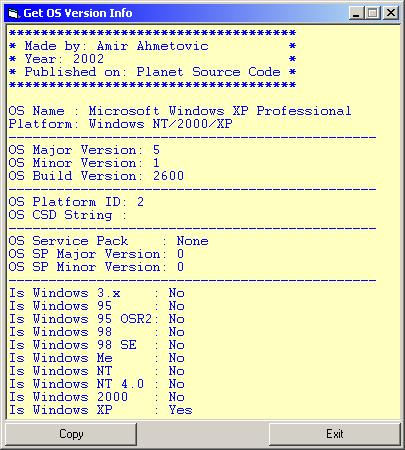



## UPDATED \- Get OS Version Info

### Description

This example shows you how to get OS name, version (major, minor, build), service packs info, platform type, 10 NEW PROPERTIES FOR EASY CHECKING OS plus whole code is really basic. If do you find it helpful, you can vote, if not then please write feedback.
 
### More Info
 

             |
---                |---
**Submitted On**   |2002-03-15 08:34:40
**By**             |[Amir Ahmetovic](https://github.com/Planet-Source-Code/PSCIndex/blob/master/ByAuthor/amir-ahmetovic.md)
**Level**          |Beginner
**User Rating**    |4.8 (91 globes from 19 users)
**Compatibility**  |VB 5\.0, VB 6\.0
**Category**       |[Miscellaneous](https://github.com/Planet-Source-Code/PSCIndex/blob/master/ByCategory/miscellaneous__1-1.md)
**World**          |[Visual Basic](https://github.com/Planet-Source-Code/PSCIndex/blob/master/ByWorld/visual-basic.md)
**Archive File**   |[UPDATED\_\-\_1062727152002\.zip](https://github.com/Planet-Source-Code/amir-ahmetovic-updated-get-os-version-info__1-36891/archive/master.zip)

